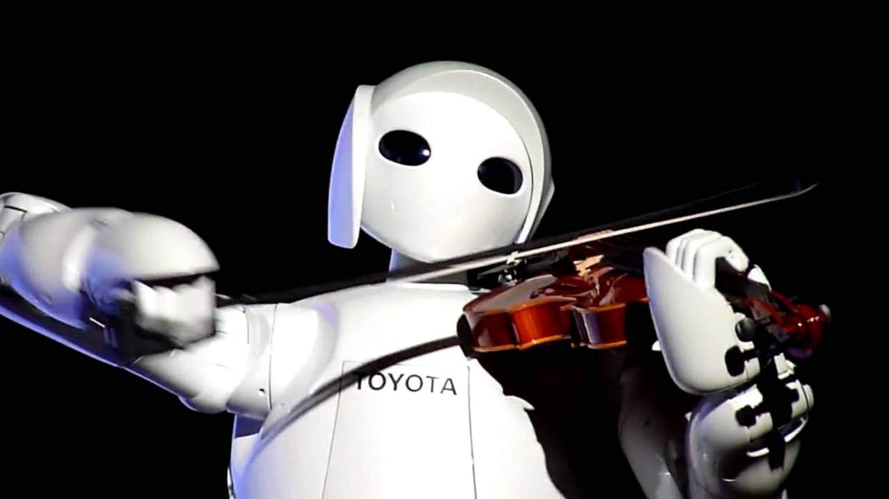
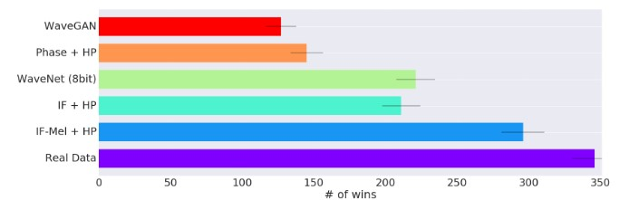
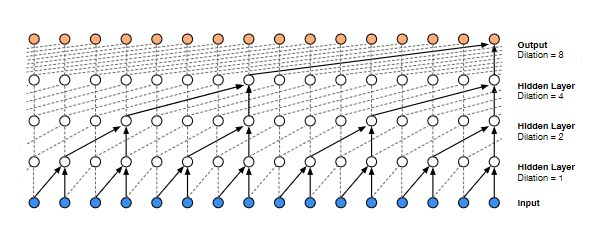
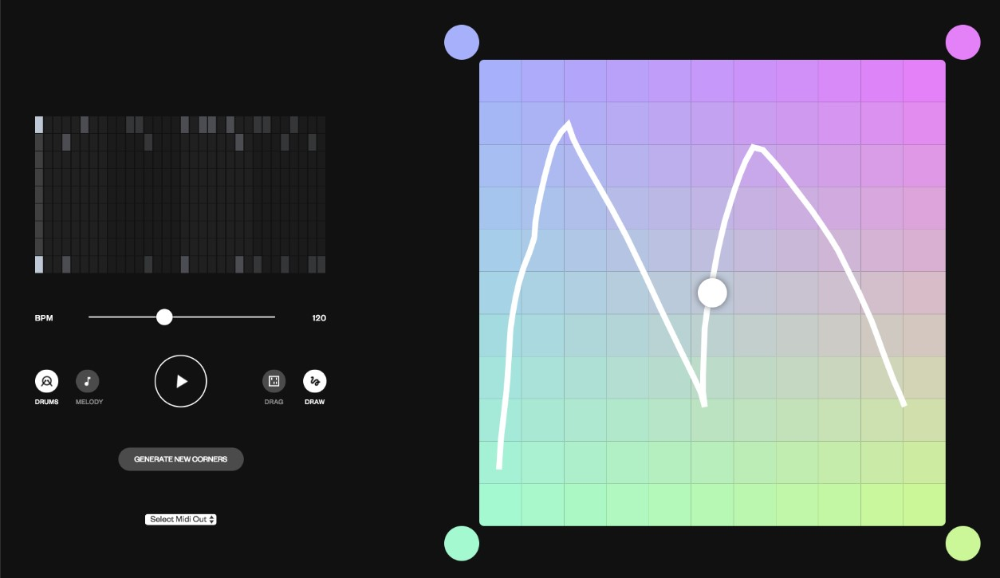
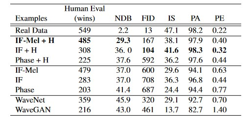
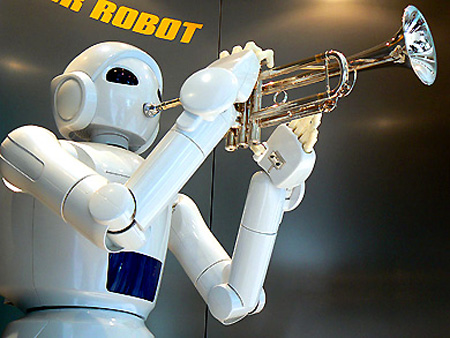
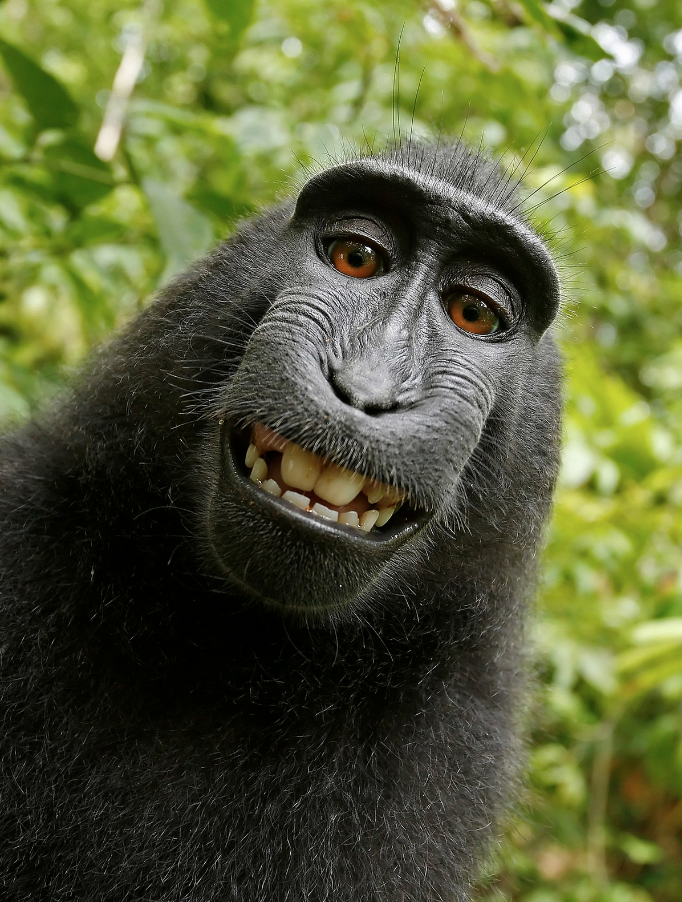
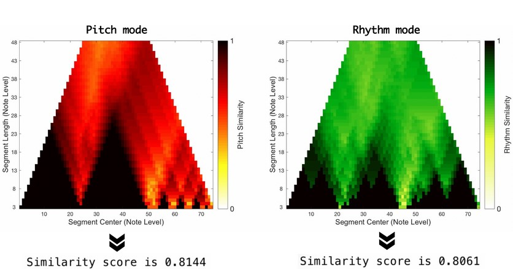

# Who owns the Mozart AI?
## Ownership and IP Considerations of AI generated music
*Mateo Osorio\
Khalil Anderson*

Northwestern University\
June 9, 2021

## Outline
- [Who owns the AI Mozart?](#who-owns-the-ai-mozart)
  - [Ownership and IP Considerations of AI generated music](#ownership-and-ip-considerations-of-ai-generated-music)
  - [Outline](#outline)
  - [Introduction](#introduction)
  - [Methods for generating music](#methods-for-generating-music)
    - [Non-ML](#non-ml)
    - [ML](#ml)
  - [Can computers make art?](#can-computers-make-art)
    - [What is art, and why do we make it?](#what-is-art-and-why-do-we-make-it)
    - [Where computers fit in](#where-computers-fit-in)
    - [The creativity of computers](#the-creativity-of-computers)
  - [Who owns generated music?](#who-owns-generated-music)
    - [The engineer](#the-engineer)
    - [The user](#the-user)
    - [The training data](#the-training-data)
    - [No one](#no-one)
    - [Detecting infringement](#detecting-infringement)
  - [The future of computer-generated music](#the-future-of-computer-generated-music)
    - [Computers are everywhere](#computers-are-everywhere)
    - [It's not good enough. Yet...](#its-not-good-enough-yet)
    - [Wave-form copyright protection](#wave-form-copyright-protection)
  - [Conclusion](#conclusion)
  - [References](#references)

## Introduction

Music generation has been around for centuries in many different ways. People have continually searched for unique and innovative ways of creating music. With each way comes different limitations to creating a full piece of music. From scratch one would have to compose a piece, get a group of people for each part, have each person learn a part including being sure they can actually perform at the level necessary, practice together, and then record and distribute the song or coordinate scheduling to perform. While seemingly a few steps, composing a piece alone is hard without being able to hear what you’re composing. This also requires some level of understanding of music theory. Playing an instrument requires physical ability that must be learned over years of training. 

Improvements in technology allowed music generation to become something accessible to more and more people. It significantly reduced the time needed to make music (CD burning as opposed to vinyl stamping, for example. As another example, people that are impaired physically in some way also gained the ability to make music. There are many reasons why people can’t make music, yet many wish to, or at least would wish to make more music they would want to enjoy listening to. As time has progressed and technology has advanced, the ability to make music has moved past only those who can play instruments to simpler mediums like dice games, soundboards, or intuitive computer interfaces. 

With the creation of anything comes property rights. In the case of music, copyright is a major part of the business. Almost all production companies and artists attempt to protect their music from being deliberately copied or accessed without purchase. Prior generative methods for music were mostly based on stochasticity to determine what note to generate next. Even Mozart tried this, by experimenting with randomly-selected music. Machine learning methods still use some probabilistic features, but songs are still fed directly into the model during training, raising the chance of music plagiarism. Models are often known to over-fit to training data to varying degrees.  Each new method of creating music raises different questions, as the way the music was generated could determine who is justified in claiming its corresponding copyright, or who is liable for infringing on another musician's copyright.

Throughout this paper, we analyze a variety of different methods of generating music, focusing on newer, state-of-the-art, Machine Learning (ML) methods that are currently raising philosophical and legal questions in the space of music creativity. Then we examine the idea of computers taking credit for art creation, and what it means for a computer to create art. Following that, we analyze the current legal standing of music generated by these models along with providing some discussion on what is being done now to protect musical copyright. Finally, the last section covers the future of the space, and where this discussion could go in the future.

## Methods for generating music
### Non-ML

Pythagoras had early intuition for the idea that music composition could be rooted in mathematical laws. Ptolemy, and Plato also believed music was rooted in math. There was a method called the Canonic Method, in which a single composed voice part is accompanied with other rules that are more open-ended for the other singers, such as singing the same melody for a set amount of time. Another Generative method pre-computing came through Mozart's Dice game that composes music based off of what you draw on a die. John Cage has generated music using the positional movement from a chess game. 

In a formalization of music generation, Xenakis [[1]](#1) introduces Stochastic music generation. Sets of equations around probability distributions based on the immediately preceding audio segment. A modern form of music generation can be seen in DJs and other methods of mixing music. These earlier examples of music generation show how people have been generating music for centuries and how the fascination with the ability to generate music according to some kind of mathematical model has been a prevailing interest most likely as another to create music one would want to listen to. Clearly, there is more to music generation than playing an instrument.

### ML

  
*Human evaluation scores across a couple ML models in terms of how many wins a model got when listeners had to determine which sounded the most human composed*

With the growing speed and storage of computers, machine learning has been attempting to replace other methods of music generation with varying levels of success. These methods take advantage of general growth in generative modeling techniques that can easily transfer to the music domain. Here will detail a SOTA method of each of the major types of ML used for music generation. 

**Transformer**  
Cheng-Zhi et. al [[2]](#2) introduces a transformer based music generation model. This attempt to take advantage of the self-attention mechanism in transformers has allowed models to learn long range coherence. Transformers also present a problem in that self-attention is that it relies on absolute positions within the softmax function. This can be fixed by using Relative attention.This involves learning another embedding from any position to a relative positional matrix by introducing a skewing procedure for any matrix. They also use local attention to limit the memory requirement. Along with this they also attempt to capture embeddings for timings and pitch where the timings are how many sixth notes apart two positions are. This attempts to capture these relative musical attributes. 

The paper explores a couple experiments. First on the J.S. Bach Chorales which is a dataset for evaluating generative music models and the Negative Log Loss (NLL) improves over a transformer and COCONET a CNN. They also experiment on the Piano-E-competition and compare it to Magenta’s PerformanceRNN and LookBackRNN. Here the transformer also has a better NLL. The MusicTF is also better at maintaining repeated structures. The MusicTransformer also outperformed other models on a human listening test.

**Neural Network**  
WaveNet [[3]](#3) builds off of the PixelRNN paper’s method of generating samples. Following the same probability distribution as the PixelCNN with no pooling. They then use dilated causal convolutions to account for the longer-term dependencies that are present in audio. The WaveNet can be trained to be conditioned on other variables. 

  
*The dilated causal convolutions used by the WaveNets*

The network is tested on Multi-speaker generation, text-to-speech, music, speech recognition. In the multi-speaker generation, the model is only conditioned on the speaker. It was able to generate human-like sounds though it does not use text, so it was modeling the acoustics of a person’s voice. In TTS, the WaveNets are conditioned on the linguistic features from the input texts along with log fundamental frequency. Here it performs better than other audio generation models in terms of a naturalness approach to actual natural speech. In the music test, they compare the preferability of audio produced from different sources. Compared to top baselines, the WaveNet was preferred. In the speech recognition task, with a few modifications to the WaveNet, the model was able to also beat the current benchmark at the time.

**Variational Autoencoders**  
Roberts et al. [[4]](#4) introduces two different models for generating audio and creates an interface to allow for some real time usage of these models. The models each attempt to create a latent space where interpolation in that space lead to similar interpolation in the real space. The MusicVAE itself uses an LSTM as its encoder and decoder. This LSTM focuses on learning 2-bar sequences either drumbeats or melody loops. 

The paper also details NSynth which is a standard autoencoder that works on general audio sequence instead of only music. These models use an interface designed in deeplearn.js. MusicVAE can perform at real time while NSynth is significantly more expensive so the author created a predefined set of sounds and pre-synthesized the possible latent space. This can still allow the user the ability to traverse the latent space. Each presents a 2-D control surface for the use to change the generative product. They were able to see progression in the model where similar beats were closer in the 2-D space.

**Generative Adversarial Networks**  
GANSynth [[5]](#5) attempts to fix some of the problems faced in WaveNet to generate audio with significant length. It does this by using a progressive GAN architecture. It also generates the audio in parallel instead of sequentially like other models. The architecture also allows for easier disentanglement of the features. 

  
*An example of the MusicVAE controls*

In training and experimenting on the model, they compare the model to WaveNets and control different features the model will use to create a song. In human testing, using the mel frequency scale and higher frequency input data provide significantly better results than the WaveNet. The audio from GANSynth also has more stable periodicity. They are also able to control the timbre produced. The biggest gain is also seen at the speed which only takes 20 milliseconds to generate to audio while the other models take minutes at least.

*Quantitative metrics regularly used to compare Music generation models comparing GanSynth, Human  and a few other models including Number of Statistically-Different Bins (NDB), Inception Score (IS), Frenchet Incpetion Distance (FID), Pitch Accuracy (PA), and Pitch Entropy (PE)*

## Can computers make art?

### What is art, and why do we make it?
Attempting to define art is something that’s been done for as long as humans have been around, and quite frankly quite beyond the scope of the paper. There’s an old definition that gets thrown around a lot: "Art is anything with no purpose other than itself." While interesting and mysterious-sounding, this wording is not exactly true. In the domain of music (the subject of this paper), most people would agree that the music that a talented musician creates is a form of art (even if they don’t like it themselves). That musician probably had some underlying reason for creating the art, however cryptic the reason might be. It could be as straightforward as it being part of their job, or it could be something romantic; “I make art because I need to; without it I am lost". In both cases, the piece of art is fulfilling a purpose, regardless of whether that purpose is measured in dollars or in the amount of food brought to the table, or in emotional satisfaction. point is, the argument can be made that music definitely has a purpose, be it for the musician creating it, the record label distributing it, or the person at the end of the speaker listening to the final record.

Having established that music (as art) necessarily needs a purpose, we can venture into the murky waters of establishing intention to non-human concepts. What are the purposes of music, and what are people trying to accomplish by generating music with the help of computers?

**Because it's hard:**
The most obvious reason is simply that we generate music using computers because we can. This is what academic research falls under. People use machines to make music, simply to prove that it can be done, and to break barriers in what’s possible. It’s a hard problem to solve, so attempting to solve it is in itself part of the reason we’d do it.

**Because the world will pay for it:**
It can be either directly (a purchase in a record store, or a performance in a concert), or indirectly (people spend money in clothing stores, and businesses figured out that playing music in stores makes customers more likely to shell out cash, so businesses are willing to pay for music). The basic idea is that music is a valued item, and someone, somewhere, is willing to pay something in exchange for music. Hence, making music is inherently valuable. You can measure the value in dollars, or in the tears of your fans, or in the number of people buying stuff in your store, what matters is that the creator gets something tangible and marketable out of their music generation.

**Because we’re humans:**
Everyone has that one song that absolutely breaks their hearts, or reminds them of times past, or makes them shed their worries on the dance floor. There’s no neuroscientist or doctor that can explain why we like music so much, and why it has such a profound emotional impact on our monkey brains. But even if we don’t understand it, we can agree that it’s there. So producing music, even if it goes nowhere, satisfies an itch within humans, and that is valuable.

### Where computers fit in
We’ve established that music is art, and music generation is valuable. What do computers have to do with this? Increasingly, artists around the world offload more of the creative process to machines. It started with instruments (technology as a means to aid humans in creating sound), then with recording (technology as a means of capturing and replaying sound), and then with analog and digital processing (technology as a means of manipulating sound as a piece of data).
We have been riding this gradual wave, and the music industry in general has seen great benefits from the adoption of technology. Musicians (most of them), are glad this technology is there, since it helps them create and record their sounds, and the non-musically-talented are happy to be able to stream music on Spotify whenever they want. 

The wave, however, is nearing a crescendo, one in which computers are threatening to take up a bit more of the creative process than we’d previously discussed. Traditionally, technology has always been there to enhance and empower human creativity. “While models are able to produce results that could actually be considered music, the role of the human musician still remains preponderant in the production of a musical piece. Here we reflect on such limitations, directing our efforts to imagining new tools and instruments that may allow us to experience new forms of interaction while supporting novel processes of creativity and music production.” [[6]](#6) Thanks to the many advances in Computer Science research, some argue that these machines are replacing the very thing they were invented to assist: human creativity and artistic sense. In order for machines to do this, however, we should ask ourselves if theoretically, philosophically, technically, computers can even do that, regardless of how much technology advances.

### The creativity of computers
Central to that question is the special verb create. Its close cousin, creativity, is the term we usually associate with art, and the process of creating art. You’d be hard pressed to find someone who doesn’t agree with the fact that all artists are creative, and without creativity the entire artistic process is pretty much upended.

First, a definition of creativity is needed. A common generalization, and one found in the Oxford dictionary under the word creativity, is that creativity is the quality that allows for the creation of something novel, something new. Under this definition, computers are certainly creative. Even if the output would be considered garbage and the aesthetic value is null, computer’s sheer computational power, combined with some level of stochastic decision making, the product would likely be something new. So in this sense, computers are definitely creative.

\
*Are computers able to create music?*

On the other hand, analyzing what generative models do leads to a concerning chain of logic. They create new outputs based on small statistical variations on a combination of bits of training data. That is, they are fed existing examples (songs, in the case of music), and then they combine what they learned to create a new song. In a sense, their creation is not new at all, because by breaking open the black box we see it’s just a combination of existing things.

Some argue that while this is true, and computers are incapable of creating novel things, humans can be said to be guilty of the same exact thing. Do humans generate independent, novel ideas, or are our creations merely reproductions and combinations of experiences and inputs? Some philosophers and artists argue that this is indeed the case. Additionally, a school of thought exists which states that art has to necessarily be created by social agents, so computers can never be attributed ownership of art according to our current context [[7]](#7). 

Others argue that creativity is not a quality of humans (or computers), but rather a process [[8]](#8)[[9]](#9). This being the case, it should follow that a process is not unique to humans, so as long as you maintain the stages and properties of the process, the medium is unimportant. Creativity can be created and replicated artificially, in the same way that it can be explained to a person or written down.

## Who owns generated music?
### The engineer
Traditionally, the law states that a certain piece of intellectual property belongs to whoever came up with it first, or whoever created it. It makes sense, following that train of logic, that the computer (or algorithm, or model) should own whatever it creates, as long as the source of the creativity or originality can be said to have come from the computer. 

In Sturm et al [[10]](#10), they explore the European law and how the current set of laws would see the owner of today’s algorithms. In their analysis of  who owns computer generated music, they see that the Court of Justice of the European Union (CJEU) would not acknowledge that a computer could own a copyright itself. This leaves either the music holders who the model was trained on, the engineers who curated the data and model, or the user who puts the final styling touches. 

This argument, regardless of its ethical or philosophical issues, creates a couple of issues in the real world. Namely, software creation is very concentrated. There’s only a handful of companies that will make, own, and license music generation software. This intense concentration of  music in the hands of a couple of multi-billion dollar corporations is dangerous. Music, and art in general, is an important component of culture and human expression. It’s how revolutions start, where trends begin and how important cultural traditions are handed down to generations below them. The thought of this important part of humanity belonging to Google and Facebook simply because they own all the algorithms that generate it artificially is scary, even dystopian. 

### The user
Most of the algorithms presented in this paper are pre-trained, and require some sort of prompt or can add styling to a model before it starts pumping out music . This is similar to an instrument for example with a guitar, the constructor of a guitar is not entitled to the copyright of music made on a guitar from that constructor. Similarly to a guitar, each method of generating music requires some human intervention to create the music. This is seen clearly in MusicVAE graphical control of the generated music. In the future, as these algorithms become better and companies will find ways to incorporate them into existing music processing software (such as Ableton or Logic X), the source of the creativity will still be at its core, human. 

To some extent, a lot of music nowadays is “made” by computers. When a producer is making music on a computer, the computer does almost all of the actual sound generation, and a lot of the time even the main parts of the song. So where does the user’s accountability with the intellectual property concerns of the music begin?

In this case, the computer is treated as but another tool in the musician’s arsenal. The input to the tool might be different and a little bit simpler than other tools, but the concept is the same. Instead of MIDI input for example, the program might take a word or a description. In both cases, the output is completely reliant on the input, and the human input is creatively unique in its own right. 

### The training data
Artists of training data songs do have protection from use in models that don’t fall under a specific set of exceptions in the EU.  While most algorithms attempt to use as much well labeled data they can find, having access to a song doesn’t automatically provide the right to using the song in a model. Specifically, a copyright holder’s permission is a requirement for training a model unless the author explicitly files an exception. Exceptions where one can use audio include quotation, parody, teaching, research, and news reporting. 

These exceptions explain why years of research into the music generation area are secure in that research is a protected exception, but this would limit these models as production models. In 2019, the EU introduces two specific exceptions related to data mining that use in science is okay if the research has lawful access to the work. The second says that use in text and data mining is okay unless the author specifically says it is not [[11]](#11). This changes the default of commercial products not being able to use copyrighted songs to all copyright songs are fair for use unless the author takes the extra step to restrict the use in this context.

### No one
Not many algorithms are truly fully computer generated. Even ones with data curation or very controlled models, generate without much specific control from the engineer, user, or the artists of the training data some semi random structure of music. It is hard to say one of 3 people have a larger impact than others, and even more so each has a claim to a hand in the final creativity of the composition suggesting that the copyright could be shared. 

In 2011 there was a massive legal dispute over a series of photographs. The photographs were selfies of indonesian macaques. Wildlife photographer David Slater travelled to the jungle, where during a photography session one of the monkeys grabbed his camera and literally took some pictures of itself. Slater claimed the photos to be his, and published them under his name and copyright. PETA, the animal rights non-profit, sued Slater, claiming that the pictures were in fact the monkey’s  property, since the monkey took the pictures. The court ruled in Slater’s favour, stating that animals cannot own copyrights. Eventually Slater settled with PETA, arranging for part of the proceeds from the pictures to be donated to conservation efforts. [[12]](#12)

*Naruto the Indonesian Macau*

There is legal precedent stating that animals cannot own something, but what about computers and algorithms? If only legal entities, such as people, corporations or countries can own property, then can a computer or an “artificial consciousness” ever own what it technically created? Or is the legal owner simply the second most responsible entity behind the creation (the photographer in the above example). 

### Detecting infringement
One precedent for detecting infringement was made in the EU. The CJEU had ruled that just a 2 second phonogram is necessary to fall under copyright infringement. This meant that any sequence that has similar enough audio structure could be seen as the same if not falling within a specific exception which allows one to use one’s copyrighted property in text and data mining. The ML music generation algorithms analyzed in this paper attempt to be wary of replicating their input, yet not many verify or explicitly prevent duplication. If someone were using one of these algorithms it raises the question of who is responsible for copyright infringement. Arguments for the engineer owning the music would say that the engineer did not take due diligence to protect a possible consumer while using their music generator and could be held liable for the infringement especially since the engineer should understand these capabilities while an end user would not necessarily be expected to.

**Automate it as well**  
Z. Yin et al. [[13]](#13) attempts to fix the problem of detecting infringement by providing an automated way of measuring the level of originality being generated by a music generator. This provides a score which allows a set of songs to be able to be classified based on similarity. It establishes a baseline of this distribution based on a random sampling of the input. The model is scored based on cardinality score where a value near 1 is similar and 0 is dissimilar. The metric is symmetric. The model then finds the element in the input set that maximizes cardinality score with the test set and subtracts it from 1, this is the Originality Score. Once the model is trained, the same scoring is done on a sampling of the generator over time and from this a distribution is calculated. This distribution is compared to the baseline. They then suggest that this scoring is automated and integrated directly into the training process as another metric used for training.

Another method for detecting infringement could be seen in Park et al [[14]](#14). which present a similarity metric for two audio samples using a cross-scape plot. This provides a visual representation along with an overall similarity score. In the visual, it shows how similar growing length segments of each audio sample are with darker colors representing a larger positive value. The segments are compared by measuring the distance between two segments. The distance they use is Levenshtein distance, edit distance, which computes the least operations (deletion, insertion, substitution) to change the segments to each other. They then use dynamic programming to perform this recursive calculation. With the distance, The Multi-scale similarity stack  is calculated. This provides the data layout for the cross-scape plot and represents the comparisons they want to make. With this design, the similarity can be calculated with the minimum edit distance between some melody in song A with a sub-subsequence in song B. 

*Two different cross-scape plots*

They then do a case study on handling plagiarism cases. They show two cases where each is an example of plagiarism as other examples were present that were not plagiarized. In comparing different feature similarity such as pitch and rhythm, the pitch similarity doesn’t show much of a pattern across plagiarism cases. In terms of rhythm each show some levels of similarity which they assume mean rhythm is more important than for determining plagiarism.

Cai et al. [[15]](#15) developed a blockchain based copyright protection system that shows promise in creating a decentralized, distributed IP enforcement system. It works by storing the music in a blockchain, where the music’s metadata (artist, label, song name, etc) is stored as an infungible piece of data. The song can then be downloaded and accessed by nodes in the network.

## The future of computer-generated music

### Computers are everywhere
Every day, more and more aspects of human life are digitized, computerized, automated and in some cases even created artificially. This is a trend which will only continue upwards, and probably only accelerate. As generative models become better and better (as they slowly approach human-levels), they will undoubtedly play an increasingly major role in the creative space. More artists will use these models as brainstorming helpers, idea generators and more. Additionally, in the same way that software already accomplishes this, music creation will become more and more accessible. Instead of having to master the guitar for years to be able to create music, people will be able to hum a tune or describe a melody, and the algorithm will create something. Millions more people are going to venture into the creative spaces as machines and software become more democratizing.

### It's not good enough. Yet...
A tour through the OpenAI Jukebox soundcloud [[16]](#16) makes it clear that while impressive, algorithms are not quite at the level where they’ll be earning platinum records or breaking the charts. Because of that, there’s not that much money in generative music models… yet. But assuming that the models will keep improving (which seems to be the case), eventually they’ll be good enough that big companies will start making lots of money from them. Spotify, Google, Facebook and Apple come to mind. Eventually it’ll be more profitable to have an algorithm make a bunch of songs and then choose the best one, as compared to paying a group of world-class musicians, producers, and engineers. Money flows to optimization. 

When that happens, it will be a matter of time before the courts go crazy over audio IP. That is exactly why, and this is a theme with technology as a whole, it’s important to catch it early and make sure the laws are in place before the technology keeps up. Industry is the hare to bureaucracy’s tortoise. The authors strongly advocate for more conversations to be had in this space, and for organizations and governments to begin talking about the intellectual property rights (or lack of them) of machines and algorithms. 

In particular, it’s necessary to be proactive about developing laws, systems and organizations that protect small, independent artists. As mentioned above, it’s only a matter of time until large technology corporations get a hold of the music industry (even more than they already have), and go on to have disproportionate control and influence over that aspect of human culture. It’s imperative to protect artists and creatives, and by extension human cultural expression. 

### Wave-form copyright protection
Devi et al.[[17]](#17) proposed in 2016 a copyright protection scheme for digital images based on visual cryptography. That is, they developed a way to embed a digital signature right on the picture, completely invisible to both people and an untrained model. The signature was found to be resistant to a number of image processing attacks.

Having shown to work well in images, the possibility of this being able to work with audio is exciting. What if the digital signature was embedded right in the waveform of the audio? This has proven to work well with radio transmission [[18]](#18). Making a protocol that withstands transformations seems to be more difficult in the audio domain, and adversarial attacks seem easier to do on audio waveforms. Audio signatures also seem more susceptible to being lost in compression. 

## Conclusion
As computers and artificial intelligence achieve increasingly impressive results in the domain of music generation, they are approaching near-human levels of sophistication and musical quality. State of the art machine learning models such as VAEs and GANs are already making music that sounds like music, especially to the untrained ear. In the next few years, it is not unrealistic to think that the music will be good enough to be sold and played to the general public. 

When this happens, we (as a society) will have to make some complicated decisions on the copyright and intellectual property considerations of this computer-generated music. Will the software company own it, or the final user who sets it up? What if no-one can own it?

While these questions are valid, and the answers likely cloudy, we establish that the most important goal is to protect the independent artist. So much of human culture, progress, and expression originates in the artist and their work. The algorithmization of music has the possibility of concentrating musical generation in the hands of a couple of large corporations. Culture and creativity thrives in the hands of small, independent creators, so we should strive (as a society) to try and keep it that way as much as we can. 

## References
<a id="1">[1]</a> 
Xenakis, *Formalized  music:  thought  and  mathematics  incomposition.*  No. 6, Pendragon Press, 1992

<a id="2">[2]</a> 
 Cheng-Zhi, A. Huang, A. Vaswani, J. Uszkoreit, N. Shazeer, I. Simon, C. Hawthorne, A. M. Dai, M. D. Hoffman, M. Dinculescu, and D. Eck, *“Music transformer”*, 2018.

<a id="3">[3]</a> 
A.   van   den   Oord,   S.   Dieleman,   H.   Zen,   K.   Simonyan,O.   Vinyals,   A.   Graves,   N.   Kalchbrenner,   A.   Senior,   and K. Kavukcuoglu, *“Wavenet: A generative model for raw audio,”* 2016.

<a id="4">[4]</a> 
A. Roberts, J. H. Engel, C. Raffel, C. Hawthorne, and D. Eck, *“A  hierarchical  latent  vector  model  for  learning  long-term structure in music,”* CoRR, vol. 1803.05428, 2018.

<a id="5">[5]</a>
 J.  Engel,  K.  K.  Agrawal,  S.  Chen,  I.  Gulrajani,  C.  Donahue,and A. Roberts, *“GANsynth: Adversarial neural audio synthesis,* ”2019.

<a id="6">[6]</a>
L. Casini, G. Marfia, and M. Roccetti, *“Some reflections on the potential and limitations of deep learning for automated music generation,”*  in 2018  IEEE  29th  Annual  International  Symposium  on  Personal,  Indoor  and  Mobile  Radio  Communications(PIMRC), pp. 27–31, IEEE, 2018.

<a id="7">[7]</a>  A.  Hertzmann, *“Can  computers  create  art?,*” in Arts,  vol.  7,p. 18, Multidisciplinary Digital Publishing Institute, 2018.

<a id="8">[8]</a> 
Still, A.; d’Inverno, M. *Can Machines Be Artists? A Deweyan Response in Theory and Practice.* Arts 2019, 8, 36

<a id="9">[9]</a>  Still, Arthur and d'Inverno, Mark. *'A history of creativity for future AI research'*, 2016

<a id="10">[10]</a> B. L. Sturm, M. Iglesias, O. Ben-Tal, M. Miron, and E. Gomez, “Artificial intelligence and music: open questions of copyrightlaw and engineering praxis,” inArts, vol. 8, p. 115, Multidisci-plinary Digital Publishing Institute, 2019.

<a id="12">[12]</a> Naruto V. Slater.  No. 16-15469, Apr 2018.

<a id="13">[13]</a> Z.  Yin,  F.  Reuben,  S.  Stepney,  and  T.  Collins,  *“A  good algorithm does not steal–it imitates: The originality report as a means of measuring when a music generation algorithm copies too  much,”*  in Artificial  Intelligence  in  Music,  Sound,  Art  and Design. EvoMUSART 2021, pp. 360–375, Springer, 2021.

<a id="14">[14]</a>   S. Park, T. Kwon, J. Lee, J. Kim, and J. Nam, *“A cross-scape plot representation for visualizing symbolic melodic similarity,”* in ISMIR, 2019.

<a id="15">[15]</a>  Z. Cai, “Usage of deep learning and blockchain in compilation and copyright protection of digital music,”* IEEE Access, vol. 8,pp. 164144–164154, 2020.

<a id="16">[16]</a>   P.  Dhariwal,  H.  Jun,  C.  Payne,  J.  W.  Kim,  A.  Radford,  and I.  Sutskever,  *“Jukebox:  A  generative  model  for  music,”* arXiv preprint arXiv:2005.00341, 2020.

<a id="17">[17]</a>  B.  P.  Devi,  K.  M.  Singh,  and  S.  Roy,  *“A  copyright  protectionscheme  for  digital  images  based  on  shuffled  singular  valuedecomposition  and  visual  cryptography,”* SpringerPlus,  vol.  5,no. 1, pp. 1–22, 2016.

<a id="18">[18]</a> Y. Shi and M. A. Jensen, *“Improved radiometric identificationof  wireless  devices  using  mimo  transmission,”* IEEE  Trans-actions  on  Information  Forensics  and  Security,  vol.  6,  no.  4, pp. 1346–1354, 2011.
